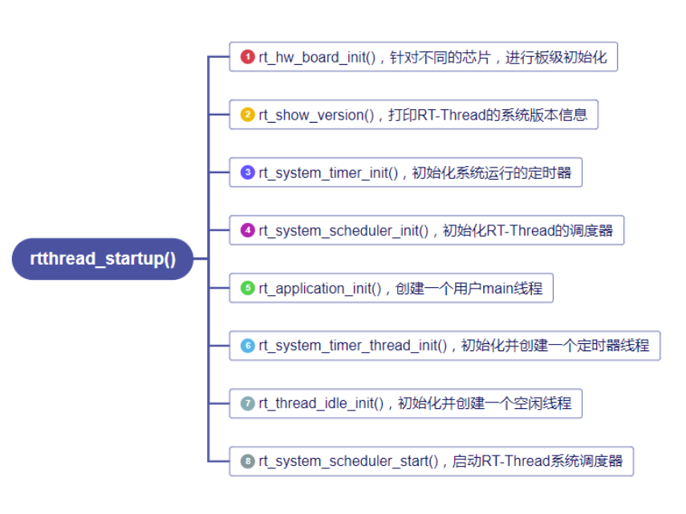
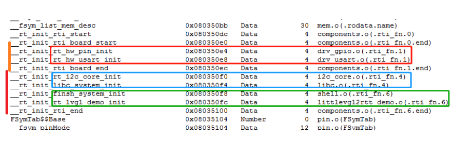

## RT-Thread自动化初始化
一般情况下我们写单片机程序，需要在主函数中先初始化时钟、外设等功能，这些都需要手动调用对应的初始化函数，而RT-Thread提供了新的函数初始化思路。

RT-Thread支持多种平台和编译器，代码统一入口为`rtthread_startup()`，然后进行一系列的初始化工作。


前面是RT-Thread的启动流程，下面我们主要分析它的自动初始化机制。在阅读源码或者例程时经常碰到类似下面的宏定义：
```c
INIT_BOARD_EXPORT(USART1_Init);
INIT_APP_EXPORT(finsh_system_init);
```
RT-Thread的外设和通用功能都是靠这种机制来进行初始化，下面从头开始分析。上面的宏定义位于`include\rtdef.h`文件中：
```c
typedef int (*init_fn_t)(void);
#ifdef _MSC_VER /* we do not support MS VC++ compiler */
    #define INIT_EXPORT(fn, level)
#else
    #if RT_DEBUG_INIT
        struct rt_init_desc
        {
            const char* fn_name;
            const init_fn_t fn;
        };
        #define INIT_EXPORT(fn, level)                                                       \
            const char __rti_##fn##_name[] = #fn;                                            \
            RT_USED const struct rt_init_desc __rt_init_desc_##fn SECTION(".rti_fn."level) = \
            { __rti_##fn##_name, fn};
    #else
        #define INIT_EXPORT(fn, level)                                                       \
            RT_USED const init_fn_t __rt_init_##fn SECTION(".rti_fn."level) = fn
    #endif
#endif
#else
#define INIT_EXPORT(fn, level)
#endif

/* board init routines will be called in board_init() function */
#define INIT_BOARD_EXPORT(fn)           INIT_EXPORT(fn, "1")

/* pre/device/component/env/app init routines will be called in init_thread */
/* components pre-initialization (pure software initilization) */
#define INIT_PREV_EXPORT(fn)            INIT_EXPORT(fn, "2")
/* device initialization */
#define INIT_DEVICE_EXPORT(fn)          INIT_EXPORT(fn, "3")
/* components initialization (dfs, lwip, ...) */
#define INIT_COMPONENT_EXPORT(fn)       INIT_EXPORT(fn, "4")
/* environment initialization (mount disk, ...) */
#define INIT_ENV_EXPORT(fn)             INIT_EXPORT(fn, "5")
/* appliation initialization (rtgui application etc ...) */
#define INIT_APP_EXPORT(fn)             INIT_EXPORT(fn, "6")
```
- typedef int (*init_fn_t)(void); 所以init_fn_t表示函数指针；
- __rt_init_##fn 表示宏拼接；
- SECTION(".rti_fn."level)其中表示代码存在指定段中；

| 初始化顺序 | 宏接口 | 描述 |
|    ---    |  ---   | --- |
|     1     | INIT_BOARD_EXPORT(fn)  | 非常早期的初始化，此时调度器还未启动 |
|     2     | INIT_PREV_EXPORT(fn)   | 主要是用于纯软件的初始化、没有太多依赖的函数 |
|     3     | INIT_DEVICE_EXPORT(fn) | 外设驱动初始化相关，比如网卡设备          |
|     4     | INIT_COMPONENT_EXPORT(fn) | 组件初始化，比如文件系统或者 LWIP        |
|     5     | INIT_ENV_EXPORT(fn)    | 系统环境初始化，比如挂载文件系统          |
|     6     | INIT_APP_EXPORT(fn)    |  	应用初始化，比如 GUI应用          |        


展开分析：
`INIT_BOARD_EXPORT(USART1_Init)` -> `INIT_EXPORT(USART1_Init, "1")`,然后宏展开为`const int __rt_init_USART1_Init() = USART1_Init  `,形成一个新的函数存在指定的`.rti_fn.1`段位置。 
- **原来是将函数存在了指定的段区域**

知道了函数存储的位置，下面看RT-Thread是如何完成自动初始化的，其实是通过`rt_components_board_init()`来初始化指定段区域内的函数：
```c
void rt_components_board_init(void)
{
#if RT_DEBUG_INIT
    int result;
    const struct rt_init_desc *desc;
    for (desc = &__rt_init_desc_rti_board_start; desc < &__rt_init_desc_rti_board_end; desc ++)
    {
        rt_kprintf("initialize %s", desc->fn_name);
        result = desc->fn();
        rt_kprintf(":%d done\n", result);
    }
#else
    const init_fn_t *fn_ptr;

    for (fn_ptr = &__rt_init_rti_board_start; fn_ptr < &__rt_init_rti_board_end; fn_ptr++)
    {
        (*fn_ptr)();
    }
#endif
}
```
注意刚才`INIT_BOARD_EXPORT(USART1_Init)`生成的函数为`__rt_init_USART1_Init（）`,上面函数内容又出现了`__rt_init_rti_board_start` 和 `__rt_init_rti_board_end`,下面就来研究一下它们有什么联系。然后就在`components.c`中发现：
```c
static int rti_start(void)
{
    return 0;
}
INIT_EXPORT(rti_start, "0");

static int rti_board_start(void)
{
    return 0;
}
INIT_EXPORT(rti_board_start, "0.end");

static int rti_board_end(void)
{
    return 0;
}
INIT_EXPORT(rti_board_end, "1.end");

static int rti_end(void)
{
    return 0;
}
INIT_EXPORT(rti_end, "6.end");
```
宏展开后：
- `__rt_init_rti_start()`函数存在`.rti_fn.0`段；
- `__rt_init_rti_board_start()`函数存在`.rti_fn.0.end`段；
- `__rt_init_rti_board_end()`函数存在`.rti_fn.1.end`段；
- `__rt_init_rti_end()`函数存在`.rti_fn.6.end`段； 

综上所述，各个段的分布如下所示：
|   序号     |  段名  | 函数指针/函数名 |
|    ---    |  ---   |      ---       |
|     1     | .rti_fn.0     | __rt_init_rti_start |
|     2     | .rti_fn.0.end | __rt_init_rti_board_start |
|     3     | .rti_fn.1     | INIT_BOARD_EXPORT(fn)     |
|     4     | .rti_fn.1.end | __rt_init_rti_board_end   |
|     5     | .rti_fn.2     | INIT_PREV_EXPORT(fn)      |
|     6     | .rti_fn.3     | INIT_DEVICE_EXPORT(fn)    |
|     7     | .rti_fn.4     | INIT_COMPONENT_EXPORT(fn) |
|     8     | .rti_fn.5     | INIT_ENV_EXPORT(fn)       |
|     9     | .rti_fn.6     | INIT_APP_EXPORT(fn)       |
|    10     | .rti_fn.6.end | __rti_init_rti_end        |          

回看上面的`rt_components_board_init()`函数，其实就是执行__rt_init_rti_board_start()地址到__rt_init_rti_board_end()地址之间的函数。


把函数通过**section**关键字存储到指定段后，在编译器进行链接时会自动收集这些函数并放到一个集中区域内，通过.map文件可以查看。(**默认section数值由小到大排列.rti_fn.0 .1 .2 .3....具体还是以map文件为准**)


从上面的分析可以看出，使用符号段的方式来存放初始化函数，好处就是当我需要添加某一个初始化函数的时候，就不需要再去改动RT-Thread的启动代码了，直接通过section关键字，把初始化函数添加到相应的符号段即可。

以上就是RT-Thread的自动初始化机制分析，正是由于采用了这种机制，所以，当我们对内核或组件进行裁剪的时候，并不需要修改RT-Thread的初始化函数，也可以对组件进行初始化。